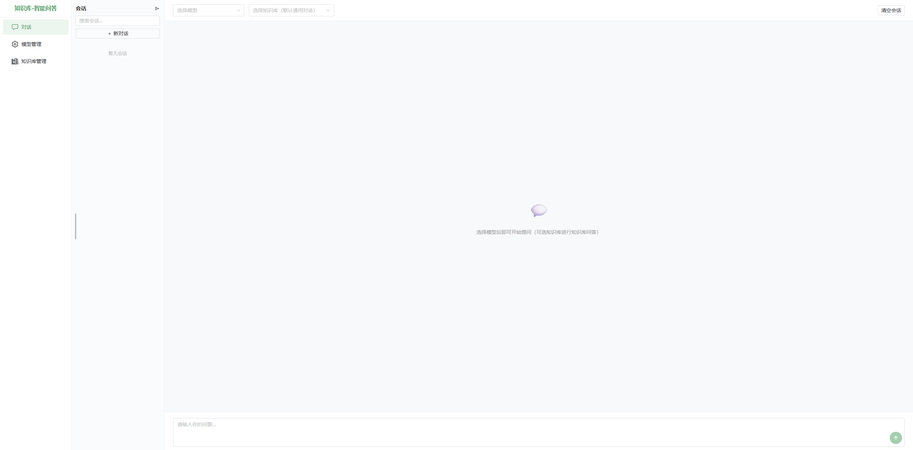

# RAGEval-Chat

基于 RAG 技术的智能问答系统，支持多知识库管理、混合检索（稠密 + 稀疏向量）、流式对话、检索质量评估。适用于金融政策法规、企业内部文档等场景。

## 技术栈

- Python 3.12
- FastAPI（后端 API 框架）
- LangChain 0.3.17
- Milvus 2.5.4（向量数据库，支持稠密 + 稀疏混合检索）
- Vue 3 + Naive UI（前端）
- Vite（前端构建工具）
- DeepSeek / Qwen (通义千问) 大模型
- Docker 20.10.24

## 功能特性

- **多知识库管理**：创建、编辑、删除知识库，自定义切分策略与向量索引配置
- **混合检索**：稠密向量 + 稀疏向量（BGE-M3），RRF 融合排序
- **流式对话**：SSE 逐 token 输出，支持知识库自定义提示词
- **检索质量评估**：上传测试集，自动评估召回率 / MRR，逐题详情与 CSV 导出
- **模型管理**：支持 DeepSeek、通义千问等多模型切换

## 项目结构

- `api/` — FastAPI 后端
  - `routers/` — chat.py (对话)、knowledge_bases.py (知识库)、models.py (模型)、sessions.py (会话)、evaluation.py (评估)
- `src/` — RAG 核心
  - `loader.py` 文档加载、`splitter.py` 分块、`retriever.py` 检索、`chain.py` QA链、`prompt.py` 提示词、`utils.py` 工具
- `evaluation/` — 评估模块
  - `runner.py` 执行引擎、`metrics.py` 指标计算、`schemas.py` 数据模型
- `frontend/` — Vue 3 前端
  - `src/views/` — Chat.vue、KnowledgeBase.vue、KBDetail.vue、EvaluationRun.vue、EvaluationReport.vue 等
- `config.py` — 全局配置（分块、嵌入、索引、检索参数）
- `docker-compose.yml` — Milvus + etcd + MinIO 基础设施
- `nginx.conf` — Nginx 反向代理配置（Docker 部署用）
- `.env` / `.env.example` — 环境变量配置文件（API Key）

### 核心代码流程图（V2.0 开始弃用）

## 项目搭建与运行

### 前置条件

- Python 3.12+
- Node.js 18+ / Bun
- Docker 20.10+
- 至少 8GB 可用内存

### 方式一：Docker Compose 一键启动

一条命令启动全部服务（Milvus + 后端 API + 前端页面）：

```bash
# 1. 复制环境变量模板并填入 API Key
cp .env.example .env
# 编辑 .env 文件，填入你的 DeepSeek / 通义千问 API Key

# 2. 一键启动（首次启动需构建镜像，约 5-15 分钟）
docker compose up -d

# 3. 访问 http://localhost:5173 进入系统
```

#### 服务说明

| 服务 | 端口 | 说明 |
|------|------|------|
| `frontend` | 5173 | Vue 3 + Nginx 前端页面 |
| `backend` | 8000 | FastAPI 后端 API |
| `standalone` | 19530 | Milvus 向量数据库 |

#### 常用命令

```bash
# 查看运行日志
docker compose logs -f

# 停止所有服务
docker compose down
```

#### 数据持久化

- Milvus 数据保存在 `volumes/` 目录下
- 知识库配置和文档保存在 `data/` 目录下
- 删除容器时数据保留，如需重置可删除对应目录

### 方式二：本地开发模式

分别启动后端和前端，方便调试开发。

#### 1. 配置 Python 环境

```bash
pip install -r requirements.txt
```

#### 2. 配置环境变量

```bash
cp .env.example .env
# 编辑 .env 文件，填入你的 DeepSeek / 通义千问 API Key
```

#### 3. 启动 Milvus

```bash
docker compose up -d
```

#### 4. 启动后端 API

```bash
uvicorn api.main:app --host 0.0.0.0 --port 8000
```

> **温馨提示**：如果提示端口被占用（`Errno 10048`），可用 `netstat -ano | findstr :8000` 查找占用进程的 PID，然后执行 `taskkill /F /PID <PID>` 释放端口后重试。

后端提供以下 API：
- `POST /api/v1/chat/stream` — 流式对话
- `GET/POST/PUT/DELETE /api/v1/models` — 模型管理
- `GET/POST/PUT/DELETE /api/v1/knowledge-bases` — 知识库管理
- `GET/POST/PUT/DELETE /api/v1/sessions` — 会话管理

#### 5. 启动前端页面

```bash
cd frontend
npm install
npm run dev
```

访问 `http://localhost:5173` 进入系统。



#### 6. 初始化知识库（首次使用）

通过前端「知识库管理」→「管理」→「新增文档」上传 PDF / DOCX 等文件，提交处理后即可在对话中使用知识库问答。

## 项目版本更新
### V1.1 update
- 新增了一部分评估数据，现在一共有100个问答对了。同时，删除掉一些开放性的问答对
- 新增了一些检索前处理方法，当前版本使用的检索处理方法为：query_rewrite_retriever，处理流程图如下：

- 新增了通义模型的使用方法 get_qwen_model，用于查询重写
- 新增了查询重写后的评估方法：execute_rewrite_retrieval
- 优化了 MilvusRetriever 类，使其适用于批量检索处理

### V1.1.1 update
- 新增 HyDE 实现查询扩展: src.chain.get_hyde_chain

- 新增 HyDE 对应的评估方法：evaluation.rag_retrieve_evaluation.execute_retrieval_batch

### V1.2 update
- 新增了 load_data_milvus_hybrid() ，用于实现混合检索
- 新增了 milvus_hybrid_retrieve() 混合检索方法
- 修改了类 MilvusRetriever，添加了混合检索方法，默认使用混合检索
- 修改了 get_qa_chain()，使用混合检索

**V1.2 更新后的问答流程图：（红色字体部分为主要更新内容）**


### V2.0 update — Web 前后端架构

#### 整体架构
- **前后端分离架构**：FastAPI 后端 API + Vue 3 前端页面，替代原有的 CLI 交互方式
- **Docker 一键部署**：Milvus + 后端 + 前端 完整容器化部署

#### 对话功能
- **流式对话（SSE）**：逐 token 实时输出，支持 RAG 检索增强与通用对话两种模式
- **RAG 检索链路**：用户提问 → Milvus 稠密/混合检索 → 召回 Top-K 文本块 → 拼接上下文 → LLM 生成回答
- **自定义提示词**：每个知识库可独立设置提示词模板，支持 {retrieve_context} 和 {question} 占位符，AI 可根据知识库内容自动生成默认提示词
- **会话管理**：对话历史持久化存储，支持多会话切换、重命名、搜索、删除，消息按会话隔离
- **引文来源展示**：右侧滑出抽屉查看检索原文片段，附带相似度分数和来源文件名
- **多模型切换**：支持 DeepSeek / 通义千问，模型管理中配置 API Key
- **消息操作**：单条消息支持复制纯文本 / Markdown 原始内容，支持重新生成回答

#### 知识库管理
- **知识库 CRUD**：基于 Milvus 的向量知识库完整 CRUD，支持上传文档（PDF/DOCX 等）、异步处理、状态轮询
- **创建轻量化**：知识库创建为单步弹窗（名称、描述、嵌入模型），切分策略与索引配置移至详情页
- **详情页四步向导**：文档管理 → 切分设置 → 索引配置 → 提交处理，完整配置链路
- **索引配置**：支持 IVF_FLAT / IVF_SQ8 / HNSW 三种密集索引，HNSW 支持 M / efConstruction 自定义；支持推荐配置 / 自定义模式
- **nprobe 参数链路**：知识库 index_config → API → MilvusRetriever → 检索时生效
- **自定义提示词**：每个知识库可独立设置提示词模板，支持 AI 根据知识库内容自动生成
- **知识库查看**：列表「查看」按钮，弹窗分 Tab 展示（基础信息 / 已上传文档），文档列表懒加载 + 分页

#### 检索质量评估
- **测试集管理**：支持上传 .xlsx 测试集文件（问题、答案、来源），多 Sheet 解析
- **评估执行**：选择知识库 + 测试集 + 检索策略（稠密/混合）→ 后台线程执行 → 逐题检索判定
- **评估指标**：Recall@K、MRR（Mean Reciprocal Rank）、命中数/总数
- **进度感知**：实时进度回调 + 前端进度遮罩（运行中 / 完成 / 失败三态），后台运行不阻塞 API
- **报告页**：逐题详情表格（召回/未召回标签、排名、分数、匹配文本），支持按状态筛选 + 关键词搜索 + CSV 导出
- **失败诊断**：评估失败记录完整 traceback，详情弹窗可查看错误堆栈
- **筛选与分页**：列表支持知识库名称搜索、状态过滤、日期区间选择，分页 15 行/页

## 项目延展
- 项目详细介绍可参考[博客](https://blog.csdn.net/quf2zy/article/details/149504959?spm=1011.2415.3001.5331)

## 许可证
   本项目采用 **MIT 许可证**，详情见 [LICENSE](LICENSE) 文件。
